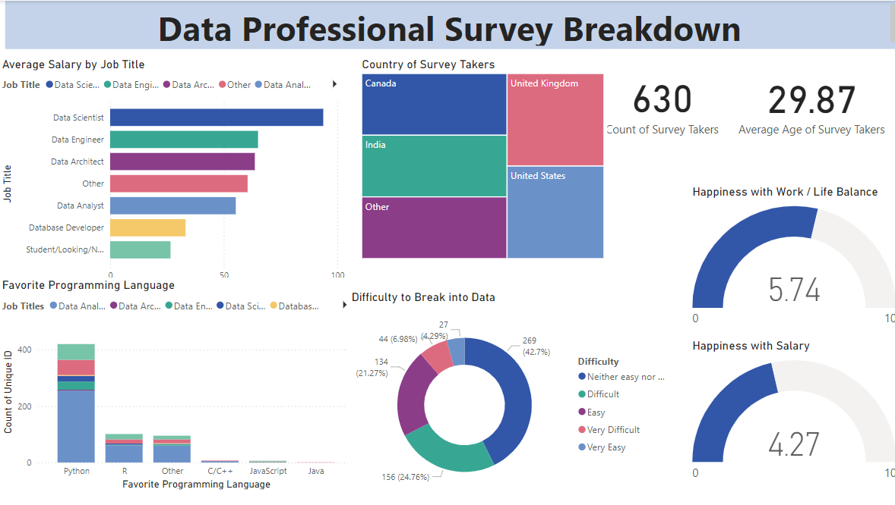

# Data Professional Survey Breakdown

This dashboard provides a breakdown of the results from a data professional survey. It includes information on the average salary by job title, country of survey takers, count of survey takers, average age of survey takers, happiness with work/life balance, favorite programming language, difficulty to break into data, and happiness with salary.

## Data Visualizations

- **Average Salary by Job Title**: A Clustred bar chart that shows the average salary for each job title.
- **Country of Survey Takers**: A Treemap chart that shows the number of survey takers from each country.
- **Count of Survey Takers**: Shows the number of survey takers for each job title.
- **Average Age of Survey Takers**: Shows the average age of survey takers for each job title.
- **Happiness with Work/Life Balance**: A Gauge chart that shows the percentage of survey takers who are happy with their work/life balance.
- **Favorite Programming Language**: A Stacked Column chart that shows the favorite programming language of survey takers.
- **Difficulty to Break into Data**: A pie chart that shows the percentage of survey takers who found it difficult to break into data.
- **Happiness with Salary**: A Gauge chart that shows the percentage of survey takers who are happy with their salary.

## How to Download and Use

This dashboard is designed for data professionals interested in learning more about the results of a data professional survey. You can explore the data in various ways:

- Compare average salaries between data scientists and data engineers.
- Identify the country with the most data professional survey takers.

## Downloading the Dashboard

This dashboard is available on GitHub. To download it, follow these steps:

1. Visit your GitHub repository where you uploaded the dashboard files.
2. Click on the green "Code" button.
3. Choose the download option that best suits your needs:
    - **Download ZIP**: Click the green "ZIP" button to download a compressed file of the entire repository.
    - **Clone with HTTPS**: Copy the HTTPS URL provided. You can use this URL with Git tools to clone the repository directly to your local machine.

## Contact

If you have any questions about this dashboard, please contact:

- **Name**: [Zabita Guliyeva]
- **Email**: [guliyevazabitaa@gmail.com]
- **GitHub**: [My Github Profile](https://github.com/zabitaguliyeva)
- **LinkedIn**: [My LinkedIn Profile](https://www.linkedin.com/in/zabita-quliyeva-43b96b21a/)
